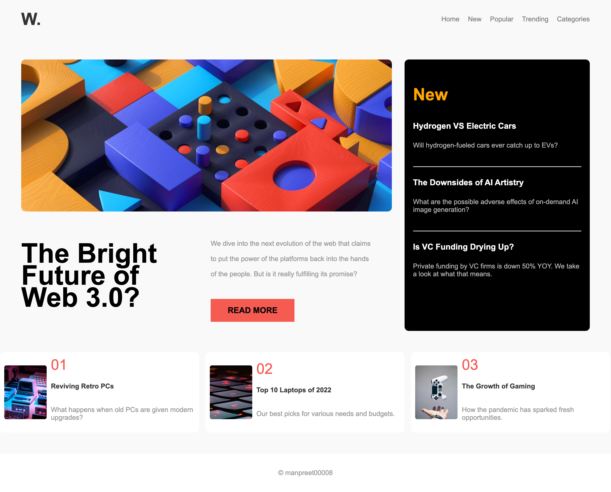
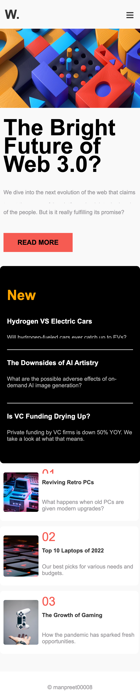

# MTM6407 Frontend Mentor Challenge - manpreet00008

## Project: News Homepage

### Student Information
- **Name:** manpreet gill
- **Student Number:** 
- **GitHub Repository:** [mtm6407-frontend-mentor-manpreet00008](https://github.com/manpreet00008/manpreet00008.git)

## Challenge Overview
This project is a solution to the **News Homepage** challenge from Frontend Mentor. The goal was to create a fully responsive news homepage using HTML, CSS, and JavaScript while closely matching the provided design mockups.

## Features
- Responsive design with CSS Grid and Flexbox
- Hamburger menu for mobile navigation
- Styled components following the given design specifications
- Interactive button elements
- Accessible and semantic HTML structure

## Technologies Used
- HTML5
- CSS3
- JavaScript
- FontAwesome (for icons)
- Git & GitHub (for version control)

## Setup Instructions
1. Clone the repository:
   ```bash
   git clone https://github.com/manpreet00008/mtm6407-frontend-mentor-manpreet00008.git
   ```
2. Navigate to the project folder:
   ```bash
   cd mtm6407-frontend-mentor-manpreet00008

   ```
3. Open `index.html` in a browser to view the project.

## File Structure
```
mtm6404-frontend-mentor-KAUR-SURJIT/
│── assets/
│   │──fonts/(Contains project fonts)
├── images/ (Contains project images)
│── index.html
│── style.css
│── script.js
│── README.md
│──SCREENSHOT (Contains project Screenshot)
```
## Screenshots Frontend Challange
### Desktop View


### Mobile View


## Screenshots 
### Desktop View


### Mobile View


## Acknowledgments
- [Frontend Mentor](https://www.frontendmentor.io/challenges/news-homepage-H6SWTa1MFl) for the challenge.
- **Professor Guer0157** for guidance.

## License
This project is for educational purposes only.

